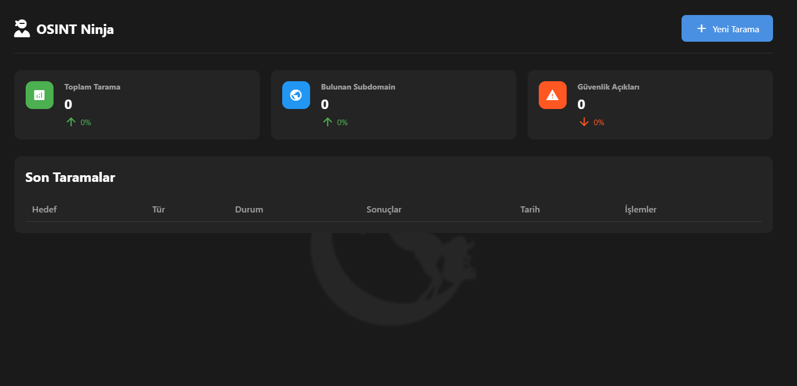

# Osint Ninja 🥷


A powerful web reconnaissance tool that helps security researchers and penetration testers gather information about web applications. OsintTool combines multiple scanning capabilities into a user-friendly interface.


## 🎥 PoC

[](https://www.youtube.com/watch?v=o6gRTMPLvd4)

👉 Click the link to watch 



---

## ✨ Features

- 🌐 **Directory Scanner**: Discover hidden directories and files
- 🔍 **Subdomain Scanner**: Find subdomains using brute-force techniques
- 📝 **JavaScript Analyzer**: Extract and analyze JavaScript files
- 🚀 **Fast & Concurrent**: Utilizes async/await for efficient scanning
- 📊 **Beautiful Dashboard**: Real-time progress and results visualization

## 🛠️ Installation


###Command Line Interface

```bash
python osint_cli.py --help
```

1. Clone the repository:
```bash
git clone https://github.com/AbdusselamKarahan/OsintTool.git
cd OsintTool
```

2. Install the required dependencies:
```bash
pip install -r requirements.txt
```

3. Run the application:
```bash
python app.py
```

The web interface will be available at `http://127.0.0.1:5000`

## 📚 Usage

### Quick Start Guide

1. After running the application, open your browser and navigate to `http://127.0.0.1:5000`
2. You'll see three main tools in the dashboard:
   - Directory Scanner
   - Subdomain Scanner
   - JavaScript Analyzer

### Directory Scanner
1. Navigate to the Directory Scanner tab
2. Enter the target URL (e.g., `https://example.com`)
3. Click "Start Scan"
4. View results in real-time:
   - HTTP Status codes
   - Response times
   - Content lengths
   - Found directories

#### Advanced Directory Scanner Options
- Use custom wordlists by placing them in the `wordlists` directory
- Adjust scan speed in the configuration
- Filter results by status codes
- Export results in JSON format

### Subdomain Scanner
1. Navigate to the Subdomain Scanner tab
2. Enter the target domain (e.g., `example.com`)
3. Click "Start Scan"
4. View discovered subdomains with:
   - Status
   - IP addresses
   - Response times

#### Advanced Subdomain Scanner Features
- DNS resolution for discovered subdomains
- Port scanning capability
- Custom DNS servers support
- Wildcard detection
- Export results in multiple formats

### JavaScript Analyzer
1. Navigate to the JavaScript Analyzer tab
2. Enter the target URL
3. Click "Start Analysis"
4. View results:
   - Found JavaScript files
   - Endpoints
   - API keys
   - Sensitive information

#### Advanced JavaScript Analysis
- Deep scanning of external JavaScript files
- Pattern matching for sensitive information
- API endpoint detection
- Source code analysis
- Security vulnerability checks

### Command Line Usage


### Example Workflow

1.Run all scans:
```bash
   python osint_cli.py -t example.com -m all
```

2. Subdomain scan only:
```bash
   python osint_cli.py -t example.com -m subdomains
```

3. Directory scan only:
```bash
   python osint_cli.py -t example.com -m dirs
```

4. JavaScript analysis only:
```bash
   python osint_cli.py -t example.com -m js
```

5. Custom wordlist:
```bash 
   python osint_cli.py -t example.com -m all -w custom_wordlist.txt
```
6. Thread count:
```bash
   python osint_cli.py -t example.com -m all --threads 20
```
7. Custom output directory:
 ```bash
   python osint_cli.py -t example.com -m all -o /path/to/output
```


### Best Practices

1. **Rate Limiting**: 
   - Use appropriate delays between requests
   - Respect the target's resources
   - Adjust thread count based on target

2. **Legal Compliance**:
   - Always obtain permission before scanning
   - Follow responsible disclosure
   - Respect privacy policies

3. **Data Management**:
   - Regularly clean up results directory
   - Secure sensitive findings
   - Use meaningful file names

4. **Error Handling**:
   - Check logs for errors
   - Verify target accessibility
   - Monitor system resources

## ⚙️ Configuration

You can customize the tool's behavior by modifying the `.env` file:

```env
DEBUG=False
LOG_LEVEL=INFO
THREADS=10
TIMEOUT=5
DIR_WORDLIST=wordlists/directories.txt
OUTPUT_DIR=results
HOST=127.0.0.1
PORT=5000
```

## 📚 Wordlists

The tool comes with default wordlists in the `wordlists` directory:
- `directories.txt`: Common web directories and files
- `subdomains.txt`: Common subdomain names

You can use your own wordlists by replacing these files or updating the paths in the `.env` file.

## 🔒 Security Features

- SSL verification bypass option for self-signed certificates
- Custom User-Agent headers
- Rate limiting
- Timeout controls
- Error handling

## 📊 Output

Results are saved in the `results` directory in JSON format:
```json
{
    "target": "https://example.com",
    "scan_info": {
        "total_paths": 345,
        "threads_used": 10,
        "timeout": 5
    },
    "directories": [
        {
            "url": "https://example.com/admin",
            "status": 200,
            "content_length": 1234,
            "response_time": 0.5
        }
    ]
}
```

## 🤝 Contributing

Contributions are welcome! Please feel free to submit a Pull Request.

## 📝 License

This project is licensed under the MIT License - see the [LICENSE](LICENSE) file for details.

## ⚠️ Disclaimer

This tool is for educational purposes only. Ensure you have permission to test any target systems.

## 🙏 Acknowledgments

- Built with Flask and Python
- Uses various open-source security tools
- Inspired by other OSINT projects

## 📞 Contact

If you have any questions or suggestions, please open an issue or contact us at [abdusselamkrhn@gmail.com]
